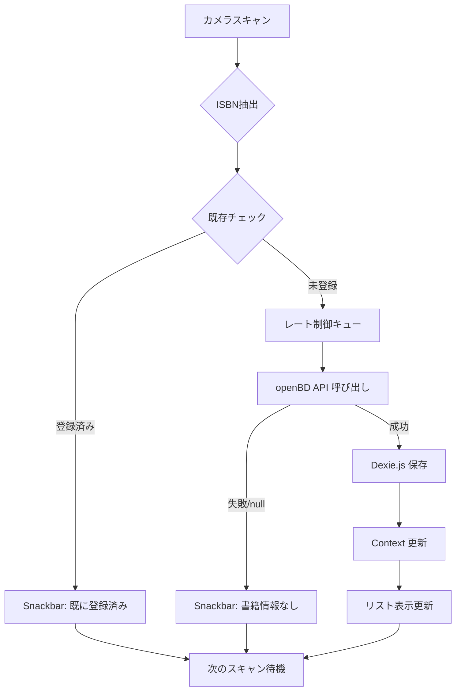

# Book Scanner - Design Document

## 1. プロジェクト概要

### 1.1 目的
カメラでISBNバーコードを連続スキャンし、openBD APIを使用して書籍情報を取得・保存するWebアプリケーション。取得した書籍データはクライアント側で管理し、CSV/JSON形式でエクスポート可能。

### 1.2 ターゲットユーザー
- 日本国内のスマートフォンユーザー
- 個人の蔵書管理を行いたいユーザー
- 図書館、書店、古本屋などで在庫管理を行う事業者

### 1.3 主要機能
1. **連続バーコードスキャン**: カメラを使用してISBNバーコード（EAN-13）を連続的にスキャン
2. **書籍情報検索**: openBD APIを使用して書籍メタデータを取得
3. **重複防止**: 既に登録済みのISBNは再スキャンを防止
4. **クライアント保存**: IndexedDBを使用してブラウザ内にデータを保存
5. **データエクスポート**: CSV形式およびJSON形式でのバックアップ/復元

### 1.4 技術スタック
- **フロントエンド**: React 19.2.0 + TypeScript 5.9.3
- **ビルドツール**: Vite 7.2.2
- **UIフレームワーク**: Material UI v6 + Emotion
- **ルーティング**: React Router v6
- **バーコード認識**: @zxing/browser
- **ストレージ**: Dexie.js (IndexedDB wrapper)
- **データエクスポート**: papaparse (CSV), native JSON
- **デプロイ**: Vercel (静的ホスティング)

### 1.5 アーキテクチャ
- **完全クライアントサイド構成**: サーバーレス、全処理をブラウザ内で実行
- **SPA (Single Page Application)**: React Router によるクライアントサイドルーティング
- **Progressive Enhancement**: カメラ非対応環境でも基本機能（リスト表示、エクスポート）は利用可能

---

## 2. アーキテクチャ設計

### 2.1 ディレクトリ構造

```
src/
├── components/
│   ├── BarcodeScanner/
│   │   ├── BarcodeScanner.tsx          # スキャナーメインコンポーネント
│   │   ├── CameraView.tsx              # カメラプレビュー表示
│   │   └── ScanFeedback.tsx            # スキャン成功/失敗のフィードバック
│   ├── BookList/
│   │   ├── BookList.tsx                # 書籍リスト表示
│   │   ├── BookCard.tsx                # 書籍カード（個別アイテム）
│   │   ├── BookDetail.tsx              # 書籍詳細ダイアログ
│   │   └── BookListToolbar.tsx         # ツールバー（検索、ソート、エクスポート）
│   ├── Layout/
│   │   ├── AppLayout.tsx               # アプリ全体のレイアウト
│   │   ├── Header.tsx                  # ヘッダー（AppBar）
│   │   └── Navigation.tsx              # ナビゲーション（BottomNavigation）
│   └── common/
│       ├── LoadingSpinner.tsx          # ローディング表示
│       ├── ErrorAlert.tsx              # エラー通知
│       └── ConfirmDialog.tsx           # 確認ダイアログ
├── hooks/
│   ├── useCamera.ts                    # カメラアクセス管理
│   ├── useBarcodeScanner.ts            # バーコードスキャンロジック
│   ├── useBookAPI.ts                   # openBD API 呼び出し（レート制限付き）
│   ├── useBookStorage.ts               # Dexie.js データ操作
│   └── useDataExport.ts                # CSV/JSON エクスポート
├── services/
│   ├── openBDApi.ts                    # openBD API クライアント
│   ├── database.ts                     # Dexie.js データベース定義
│   ├── csvExport.ts                    # CSV 生成処理
│   ├── jsonBackup.ts                   # JSON バックアップ/復元
│   └── apiRateLimiter.ts               # API レート制限制御
├── types/
│   ├── book.ts                         # 書籍データ型定義
│   ├── openBD.ts                       # openBD API レスポンス型
│   └── index.ts                        # 型エクスポート
├── utils/
│   ├── isbn.ts                         # ISBN バリデーション
│   └── constants.ts                    # 定数定義
├── theme/
│   └── muiTheme.ts                     # Material UI テーマ設定
├── App.tsx                             # ルートコンポーネント
└── main.tsx                            # エントリーポイント
```

### 2.2 状態管理

**React Context + useReducer パターン**を採用:

```typescript
// BookContext の構造
interface BookState {
  books: Book[];
  loading: boolean;
  error: string | null;
  scannerActive: boolean;
}

type BookAction =
  | { type: 'ADD_BOOK'; payload: Book }
  | { type: 'REMOVE_BOOK'; payload: string } // ISBN
  | { type: 'SET_BOOKS'; payload: Book[] }
  | { type: 'SET_LOADING'; payload: boolean }
  | { type: 'SET_ERROR'; payload: string | null }
  | { type: 'TOGGLE_SCANNER' };
```

### 2.3 データフロー



### 2.4 IndexedDB スキーマ (Dexie.js)

```typescript
// database.ts
import Dexie, { Table } from 'dexie';

export interface Book {
  id?: number;                    // Auto-increment primary key
  isbn: string;                   // Unique index
  title: string;
  authors: string[];
  publisher: string;
  publishedDate: string;
  coverImage?: string;            // URL
  description?: string;
  pageCount?: number;
  price?: string;
  addedAt: Date;
}

export class BookDatabase extends Dexie {
  books!: Table<Book, number>;

  constructor() {
    super('BookScannerDB');
    this.version(1).stores({
      books: '++id, &isbn, title, addedAt', // &isbn = unique
    });
  }
}

export const db = new BookDatabase();
```

---

## 3. 技術実装詳細

### 3.1 バーコードスキャン (@zxing/browser)

#### 実装方針
- **EAN-13 フォーマット**に特化（ISBNは13桁のEAN-13として表現）
- カメラストリームを維持し、連続スキャンを実現
- スキャン成功後も停止せず、次のスキャン待機状態を継続

#### カメラ設定
```typescript
const constraints: MediaStreamConstraints = {
  video: {
    facingMode: { ideal: 'environment' }, // バックカメラ優先
    width: { ideal: 1280 },
    height: { ideal: 720 },
  },
};
```

#### デコード設定
```typescript
import { BrowserMultiFormatReader, DecodeHintType } from '@zxing/library';

const hints = new Map();
hints.set(DecodeHintType.POSSIBLE_FORMATS, [BarcodeFormat.EAN_13]);
hints.set(DecodeHintType.TRY_HARDER, true);

const codeReader = new BrowserMultiFormatReader(hints);
```

### 3.2 openBD API 連携

#### API 仕様
- **エンドポイント**: `https://api.openbd.jp/v1/get?isbn={ISBN}`
- **メソッド**: GET
- **認証**: 不要
- **レスポンス**: JSON配列（1件の場合も配列）

#### レスポンス構造
```typescript
interface OpenBDResponse {
  summary: {
    isbn: string;
    title: string;
    author: string;
    publisher: string;
    pubdate: string;
    cover: string; // URL
  };
  onix: {
    DescriptiveDetail: {
      TitleDetail: { TitleElement: { TitleText: { content: string } } };
      Contributor: Array<{ PersonName: { content: string } }>;
    };
    PublishingDetail: {
      Publisher: { PublisherName: string };
      PublishingDate: Array<{ Date: string }>;
    };
  };
}
```

#### レート制限対策

**実装方式**: Promise キュー + 最小インターバル制御

```typescript
// apiRateLimiter.ts
class APIRateLimiter {
  private queue: Array<() => Promise<any>> = [];
  private processing = false;
  private lastCallTime = 0;
  private readonly minInterval = 1000; // 1秒

  async enqueue<T>(apiCall: () => Promise<T>): Promise<T> {
    return new Promise((resolve, reject) => {
      this.queue.push(async () => {
        try {
          const result = await apiCall();
          resolve(result);
        } catch (error) {
          reject(error);
        }
      });
      this.processQueue();
    });
  }

  private async processQueue() {
    if (this.processing || this.queue.length === 0) return;
    
    this.processing = true;
    
    while (this.queue.length > 0) {
      const now = Date.now();
      const timeSinceLastCall = now - this.lastCallTime;
      
      if (timeSinceLastCall < this.minInterval) {
        await this.delay(this.minInterval - timeSinceLastCall);
      }
      
      const apiCall = this.queue.shift()!;
      this.lastCallTime = Date.now();
      await apiCall();
    }
    
    this.processing = false;
  }

  private delay(ms: number): Promise<void> {
    return new Promise(resolve => setTimeout(resolve, ms));
  }
}
```

#### リトライロジック
- **最大リトライ回数**: 3回
- **バックオフ戦略**: 指数バックオフ (1s, 2s, 4s)
- **リトライ対象**: ネットワークエラー、タイムアウト、5xx エラー
- **リトライ除外**: 4xx エラー（クライアントエラー）

```typescript
async function fetchWithRetry(
  url: string,
  maxRetries = 3
): Promise<Response> {
  for (let i = 0; i < maxRetries; i++) {
    try {
      const response = await fetch(url, { 
        signal: AbortSignal.timeout(10000) // 10秒タイムアウト
      });
      
      if (response.ok || response.status < 500) {
        return response;
      }
      
      // 5xx エラーはリトライ
      if (i < maxRetries - 1) {
        await new Promise(resolve => 
          setTimeout(resolve, Math.pow(2, i) * 1000)
        );
      }
    } catch (error) {
      if (i === maxRetries - 1) throw error;
      await new Promise(resolve => 
        setTimeout(resolve, Math.pow(2, i) * 1000)
      );
    }
  }
  throw new Error('Max retries exceeded');
}
```

### 3.3 連続スキャン仕様

#### スキャンフロー
1. **スキャン開始**: カメラ起動、ストリーム開始
2. **バーコード検出**: ZXing がISBNをデコード
3. **重複チェック**: IndexedDB で既存 ISBN を検索
   - **既存**: Snackbar で通知、スキャン継続
   - **新規**: API 呼び出しキューに追加
4. **API 呼び出し**: レート制限を考慮して順次実行
5. **データ保存**: 成功時に IndexedDB へ保存
6. **UI 更新**: リストに新規書籍を表示
7. **フィードバック**: 成功アニメーション、バイブレーション
8. **次のスキャン待機**: ストリームを維持したまま次の検出を待機

#### UX フィードバック
- **スキャン成功**: 
  - 緑色のフラッシュアニメーション
  - バイブレーション（`navigator.vibrate(200)`）
  - Snackbar: 「◯◯を追加しました」
- **重複検出**:
  - 黄色のフラッシュアニメーション
  - Snackbar: 「既に登録済みです」
- **書籍情報なし**:
  - 赤色のフラッシュアニメーション
  - Snackbar: 「書籍情報が見つかりませんでした」
- **スキャン中**:
  - スキャンガイド（四隅のフレーム表示）
  - 「バーコードをカメラに向けてください」メッセージ

#### 制御UI
- **開始/停止ボタン**: スキャンの手動制御
- **カメラ切り替えボタン**: フロント/バックカメラの切り替え（複数カメラがある場合）
- **履歴表示**: 最近スキャンした書籍をリアルタイム表示

### 3.4 データエクスポート

#### CSV エクスポート (papaparse)

```typescript
// csvExport.ts
import Papa from 'papaparse';

interface CSVExportOptions {
  fields: string[];
  filename: string;
}

export function exportBooksToCSV(books: Book[], options?: Partial<CSVExportOptions>) {
  const fields = options?.fields || [
    'isbn', 'title', 'authors', 'publisher', 'publishedDate', 'addedAt'
  ];
  
  const data = books.map(book => ({
    ...book,
    authors: book.authors.join('; '), // 配列を文字列に変換
    addedAt: new Date(book.addedAt).toLocaleString('ja-JP'),
  }));
  
  const csv = Papa.unparse(data, {
    quotes: true,
    header: true,
    columns: fields,
  });
  
  // UTF-8 BOM 付きで出力（Excel 対応）
  const BOM = '\uFEFF';
  const blob = new Blob([BOM + csv], { 
    type: 'text/csv;charset=utf-8;' 
  });
  
  const filename = options?.filename || 
    `books_${new Date().toISOString().split('T')[0]}.csv`;
  
  downloadBlob(blob, filename);
}
```

#### JSON バックアップ/復元

```typescript
// jsonBackup.ts
export function exportBooksToJSON(books: Book[]) {
  const data = {
    version: 1,
    exportedAt: new Date().toISOString(),
    books: books,
  };
  
  const json = JSON.stringify(data, null, 2);
  const BOM = '\uFEFF';
  const blob = new Blob([BOM + json], { 
    type: 'application/json;charset=utf-8;' 
  });
  
  const filename = `books_backup_${new Date().toISOString().split('T')[0]}.json`;
  downloadBlob(blob, filename);
}

export async function importBooksFromJSON(
  file: File,
  db: BookDatabase
): Promise<{ imported: number; skipped: number }> {
  const text = await file.text();
  const data = JSON.parse(text);
  
  if (data.version !== 1) {
    throw new Error('Unsupported backup version');
  }
  
  let imported = 0;
  let skipped = 0;
  
  for (const book of data.books) {
    const existing = await db.books.where('isbn').equals(book.isbn).first();
    
    if (existing) {
      skipped++;
    } else {
      await db.books.add(book);
      imported++;
    }
  }
  
  return { imported, skipped };
}

function downloadBlob(blob: Blob, filename: string) {
  const url = URL.createObjectURL(blob);
  const link = document.createElement('a');
  link.href = url;
  link.download = filename;
  document.body.appendChild(link);
  link.click();
  document.body.removeChild(link);
  URL.revokeObjectURL(url);
}
```

### 3.5 Material UI 設定

#### テーマカスタマイズ

```typescript
// muiTheme.ts
import { createTheme } from '@mui/material/styles';
import { jaJP } from '@mui/material/locale';

export const theme = createTheme(
  {
    palette: {
      mode: 'light',
      primary: {
        main: '#1976d2',
      },
      secondary: {
        main: '#dc004e',
      },
      success: {
        main: '#4caf50',
      },
      warning: {
        main: '#ff9800',
      },
      error: {
        main: '#f44336',
      },
    },
    typography: {
      fontFamily: [
        '-apple-system',
        'BlinkMacSystemFont',
        'Segoe UI',
        'Hiragino Sans',
        'Hiragino Kaku Gothic ProN',
        'Yu Gothic',
        'Meiryo',
        'sans-serif',
      ].join(','),
    },
    components: {
      MuiButton: {
        styleOverrides: {
          root: {
            textTransform: 'none', // ボタンテキストを大文字化しない
          },
        },
      },
      MuiCard: {
        styleOverrides: {
          root: {
            borderRadius: 12,
          },
        },
      },
    },
  },
  jaJP // 日本語ローカライゼーション
);
```

#### レスポンシブブレークポイント

Material UI のデフォルトブレークポイントを使用:
- **xs**: 0px - 600px (スマートフォン)
- **sm**: 600px - 900px (タブレット縦)
- **md**: 900px - 1200px (タブレット横、小型ノートPC)
- **lg**: 1200px - 1536px (デスクトップ)
- **xl**: 1536px+ (大型デスクトップ)

モバイルファーストアプローチで実装:
```typescript
<Box
  sx={{
    padding: { xs: 2, sm: 3, md: 4 },
    gridTemplateColumns: { 
      xs: '1fr', 
      sm: 'repeat(2, 1fr)', 
      md: 'repeat(3, 1fr)' 
    },
  }}
>
  {/* Content */}
</Box>
```

---

## 4. 非機能要件

### 4.1 パフォーマンス

#### 目標値
- **初回ロード**: < 3秒（3G回線）
- **スキャン→保存**: < 2秒（レート制限考慮）
- **リスト表示**: 100件まで < 1秒
- **CSV エクスポート**: 1000件 < 5秒

#### 最適化戦略
- **コード分割**: React.lazy + Suspense でルート単位のコード分割
- **画像遅延ロード**: IntersectionObserver を使用した遅延ロード
- **仮想スクロール**: 大量データ表示時（500件以上）は react-window を検討
- **メモ化**: useMemo, useCallback で不要な再レンダリングを防止

### 4.2 ブラウザ互換性

#### サポート対象
- **モバイル**:
  - Chrome for Android 最新版
  - Safari for iOS 14+
- **デスクトップ**:
  - Chrome 90+
  - Edge 90+
  - Safari 14+
  - Firefox 88+

#### 必須機能の互換性
- `getUserMedia` API (カメラアクセス)
- IndexedDB
- ES2022 機能 (Vite がトランスパイル)

### 4.3 セキュリティ

#### HTTPS 必須
- カメラ API は HTTPS 環境でのみ動作
- Vercel は自動的に HTTPS を提供

#### データプライバシー
- 全データはクライアント側のみに保存
- サーバーへのデータ送信なし
- openBD API へは ISBN のみ送信（個人情報なし）

#### XSS 対策
- React のデフォルト エスケープ処理に依存
- `dangerouslySetInnerHTML` は使用しない

### 4.4 エラーハンドリング

#### カテゴリ別対応

| エラー種別 | 原因 | 対応 |
|-----------|------|------|
| カメラアクセス拒否 | ユーザーが権限を拒否 | 権限リクエスト手順を表示、再試行ボタン |
| カメラ非対応 | デバイスにカメラがない | 機能制限を通知、リスト表示のみ利用可能 |
| ISBN 未登録 | openBD にデータなし | Snackbar で通知、スキャン継続 |
| ネットワークエラー | オフライン、API ダウン | リトライ、エラーメッセージ表示 |
| ストレージ容量不足 | IndexedDB 容量制限 | 古いデータの削除を促す、エクスポートを推奨 |
| レート制限超過 | API 過負荷 | キューイング、ユーザーに待機を通知 |

#### グローバルエラーバウンダリ
```typescript
<ErrorBoundary
  fallback={<ErrorFallback />}
  onError={(error, errorInfo) => {
    console.error('Uncaught error:', error, errorInfo);
  }}
>
  <App />
</ErrorBoundary>
```

---

## 5. Vercel デプロイ設定

### 5.1 デプロイ構成

#### ビルド設定
- **フレームワーク**: Vite
- **ビルドコマンド**: `npm run build`
- **出力ディレクトリ**: `dist/`
- **Node.js バージョン**: 18.x 以上

#### 自動設定項目
- HTTPS 自動有効化
- SPA フォールバック（`/index.html` へのリダイレクト）
- 静的アセットのキャッシュ最適化
- Gzip / Brotli 圧縮

### 5.2 環境変数

**不要**: openBD API は認証不要のため、環境変数の設定は必要なし

### 5.3 カスタムドメイン

Vercel ダッシュボードからカスタムドメインを設定可能:
1. Vercel プロジェクト設定 > Domains
2. ドメインを追加
3. DNS レコードを設定（Vercel が自動検証）

### 5.4 プレビューデプロイメント

- **Pull Request**: 各 PR に自動的にプレビュー環境が作成
- **ブランチ**: `main` 以外のブランチも自動デプロイ可能
- **本番**: `main` ブランチへのマージで本番デプロイ

---

## 6. 開発フェーズ

### Phase 1: MUI セットアップと基本レイアウト

**目標**: Material UI を導入し、アプリの基本構造を構築

#### タスク
1. **依存関係インストール**
   ```bash
   npm install @mui/material @emotion/react @emotion/styled
   npm install @mui/icons-material
   npm install react-router-dom
   ```

2. **テーマ設定**
   - `src/theme/muiTheme.ts` 作成
   - 日本語フォント設定
   - カスタムカラーパレット

3. **レイアウトコンポーネント**
   - `AppLayout`: 全体のレイアウト構造
   - `Header`: AppBar with タイトル
   - `Navigation`: BottomNavigation（スキャン、リスト、設定）

4. **ルーティング設定**
   - `/`: ホーム（リスト表示）
   - `/scan`: スキャナー画面
   - `/settings`: 設定画面

5. **共通コンポーネント**
   - `LoadingSpinner`
   - `ErrorAlert`
   - `ConfirmDialog`

#### 成果物
- Material UI が統合された基本アプリ構造
- ナビゲーション可能な3つのルート
- レスポンシブ対応のレイアウト

---

### Phase 2: スキャナー + API 連携

**目標**: バーコードスキャン、openBD API 呼び出し、データ保存機能を実装

#### タスク
1. **依存関係インストール**
   ```bash
   npm install @zxing/browser @zxing/library
   npm install dexie
   ```

2. **データベース設計**
   - `src/services/database.ts`: Dexie.js スキーマ定義
   - `src/types/book.ts`: 型定義

3. **openBD API サービス**
   - `src/services/openBDApi.ts`: API クライアント
   - `src/services/apiRateLimiter.ts`: レート制限制御
   - リトライロジック実装

4. **バーコードスキャナー**
   - `src/components/BarcodeScanner/BarcodeScanner.tsx`
   - `src/hooks/useCamera.ts`: カメラアクセス管理
   - `src/hooks/useBarcodeScanner.ts`: スキャンロジック
   - 連続スキャン対応

5. **データフロー実装**
   - スキャン → 重複チェック → API 呼び出し → 保存
   - Context による状態管理
   - `src/hooks/useBookStorage.ts`: CRUD 操作

6. **UX フィードバック**
   - スキャン成功/失敗のアニメーション
   - Snackbar 通知
   - バイブレーション

#### 成果物
- 動作する連続バーコードスキャナー
- openBD API からの書籍情報取得
- IndexedDB への保存機能
- 重複防止ロジック

---

### Phase 3: 書籍リスト管理

**目標**: 保存された書籍のリスト表示、詳細表示、削除機能

#### タスク
1. **リスト表示**
   - `src/components/BookList/BookList.tsx`
   - `src/components/BookList/BookCard.tsx`: カード UI
   - グリッドレイアウト（レスポンシブ）

2. **書籍詳細**
   - `src/components/BookList/BookDetail.tsx`: ダイアログ表示
   - 書籍情報の全フィールド表示
   - カバー画像の拡大表示

3. **削除機能**
   - 個別削除（スワイプまたはボタン）
   - 一括削除（選択モード）
   - 確認ダイアログ

4. **ツールバー**
   - `src/components/BookList/BookListToolbar.tsx`
   - 書籍数の表示
   - アクションボタン（エクスポート、削除）

5. **空状態**
   - 書籍が0件の場合の UI
   - スキャンへの誘導

#### 成果物
- 書籍リストの表示機能
- 詳細情報のモーダル表示
- 削除機能（個別・一括）

---

### Phase 4: CSV エクスポート

**目標**: 書籍データを CSV 形式でエクスポート

#### タスク
1. **依存関係インストール**
   ```bash
   npm install papaparse
   npm install -D @types/papaparse
   ```

2. **CSV 生成**
   - `src/services/csvExport.ts`
   - UTF-8 BOM 付き出力（Excel 対応）
   - フィールド選択機能

3. **エクスポート UI**
   - ツールバーにエクスポートボタン追加
   - ファイル名のカスタマイズ
   - エクスポート完了の通知

4. **エクスポート設定**
   - 出力フィールドの選択（オプション）
   - 日付フォーマットの選択

#### 成果物
- CSV エクスポート機能
- Excel で開ける日本語 CSV

---

### Phase 5: 高度な機能と UX 改善

**目標**: 検索、フィルター、JSON バックアップ、PWA 対応

#### タスク
1. **検索・フィルター**
   - タイトル、著者、出版社での検索
   - 日付範囲フィルター
   - リアルタイム検索（debounce）

2. **ソート機能**
   - 追加日時（昇順・降順）
   - タイトル（あいうえお順）
   - 著者名、出版社

3. **JSON バックアップ/復元**
   - `src/services/jsonBackup.ts`
   - 全データのエクスポート
   - インポート時のマージロジック（重複スキップ）
   - インポート結果の通知

4. **PWA 対応**
   ```bash
   npm install -D vite-plugin-pwa
   ```
   - `vite.config.ts` に PWA プラグイン追加
   - マニフェスト作成
   - Service Worker 設定
   - アプリアイコン作成

5. **UX 改善**
   - ローディング状態の洗練
   - アニメーションの追加
   - アクセシビリティ改善（ARIA ラベル）
   - ダークモード対応（オプション）

6. **パフォーマンス最適化**
   - 画像の遅延ロード
   - コード分割の最適化
   - バンドルサイズの分析と削減

#### 成果物
- 検索・フィルター・ソート機能
- JSON バックアップ/復元
- PWA として動作するアプリ
- 改善された UX

---

## 7. テスト戦略

### 7.1 テスト方針

- **手動テスト**: Phase 1-3 は手動テスト中心
- **自動テスト**: Phase 4-5 で主要機能の単体テスト追加（オプション）

### 7.2 テスト環境

#### デバイステスト
- **iOS**: Safari (iPhone 12 以降)
- **Android**: Chrome (Pixel 3 以降)
- **デスクトップ**: Chrome, Safari, Edge

#### カメラテスト
- 実機でのカメラ動作確認必須
- 様々な照明条件でのテスト
- 異なるバーコード品質でのテスト

### 7.3 テストケース

#### 機能テスト
- [ ] バーコードスキャンが成功する
- [ ] 既存 ISBN を再スキャンすると拒否される
- [ ] openBD で見つからない ISBN の処理
- [ ] ネットワークエラー時のリトライ
- [ ] 書籍リストの表示
- [ ] 書籍の削除
- [ ] CSV エクスポート
- [ ] JSON バックアップ/復元

#### 非機能テスト
- [ ] レスポンシブデザインの動作
- [ ] パフォーマンス（ローディング時間）
- [ ] オフライン動作（PWA）
- [ ] ブラウザ互換性

---

## 8. 今後の拡張案

Phase 5 完了後の将来的な拡張機能:

1. **データ分析**
   - 蔵書統計（出版社別、年代別）
   - グラフ表示

2. **タグ機能**
   - 書籍へのカスタムタグ付け
   - タグによるフィルター

3. **評価・メモ**
   - 星評価
   - 個人的なメモの追加

4. **共有機能**
   - リストの共有 URL 生成
   - QR コードでの共有

5. **API 拡張**
   - Google Books API などの追加（オプション）
   - カバー画像のローカルキャッシュ

6. **同期機能**
   - クラウドストレージとの同期（オプション）
   - デバイス間のデータ同期

---

## 9. 参考リンク

### API ドキュメント
- [openBD API](https://openbd.jp/)

### ライブラリドキュメント
- [Material UI v6](https://mui.com/)
- [React Router v6](https://reactrouter.com/)
- [ZXing TypeScript](https://github.com/zxing-js/library)
- [Dexie.js](https://dexie.org/)
- [papaparse](https://www.papaparse.com/)

### デプロイ
- [Vercel Documentation](https://vercel.com/docs)

---

**最終更新**: 2025年11月18日
